# axdx_module
This repo is for showcasing some UX deliverables or ideas of modules at FHNW

## First assignment
Recreation of existing application with Figma / XD

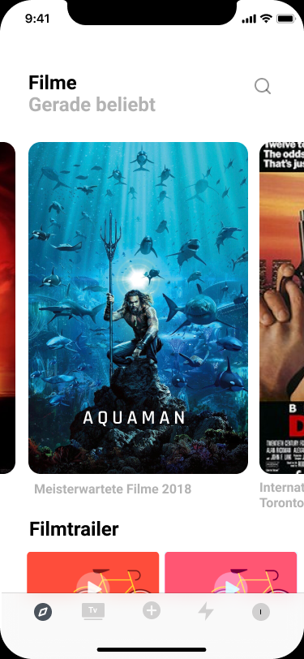   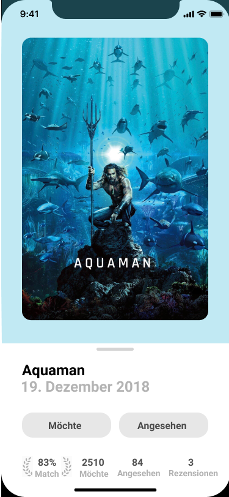   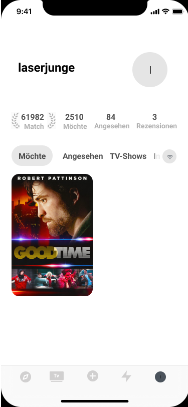

> All Images used are for educational purpose and explicit non-commercial. No Copyright Infringment intended.

## Second assignment
SRF is partially owned by the Swiss goverment and is as such responsible for informing And entertaining the masses.
For educational purposes, they asked the FHNW to design a News application for our Generation (meaning the people that stopped reading 
want to look at images, videos or opinion pieces).

This case study was done in Adobe XD, so the interaction can't be viewed in github.

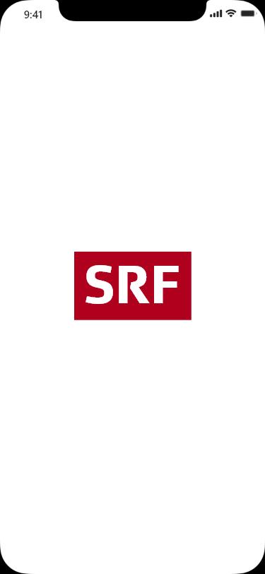 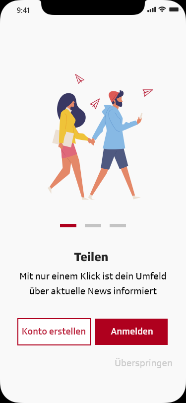  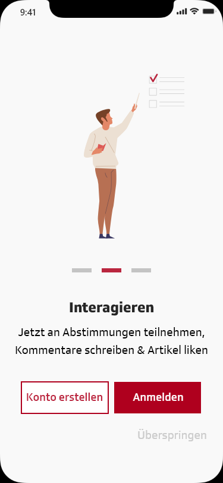 

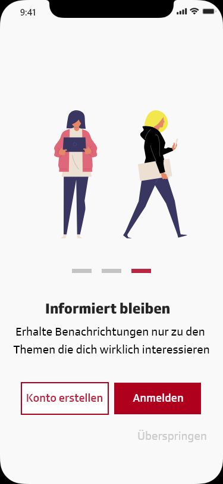 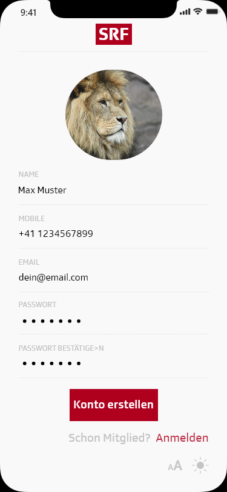 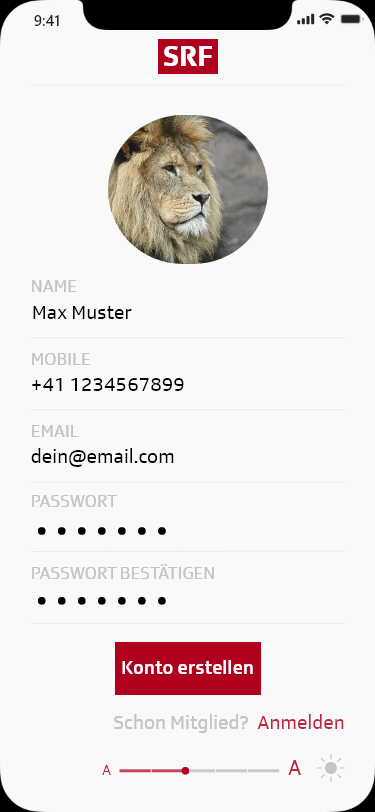 

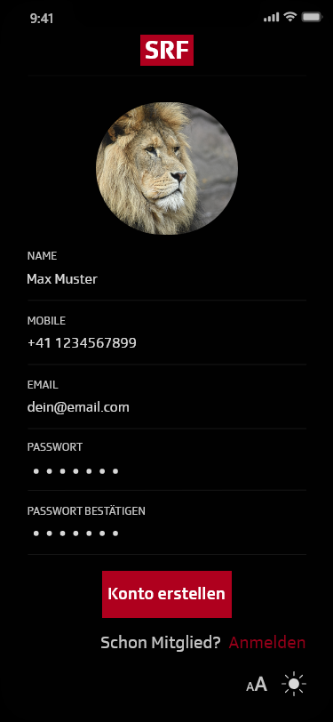 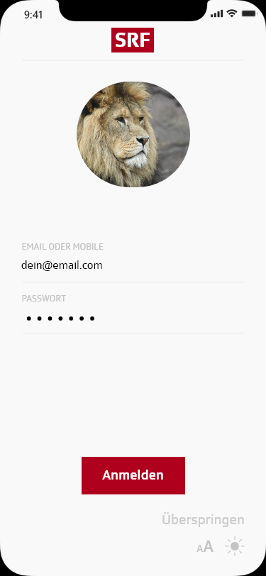 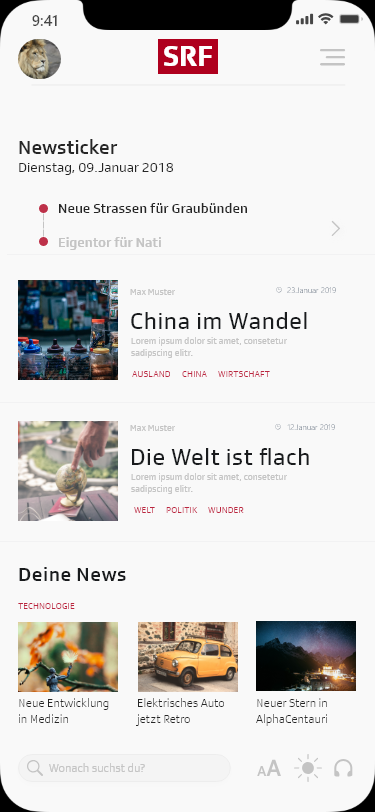 

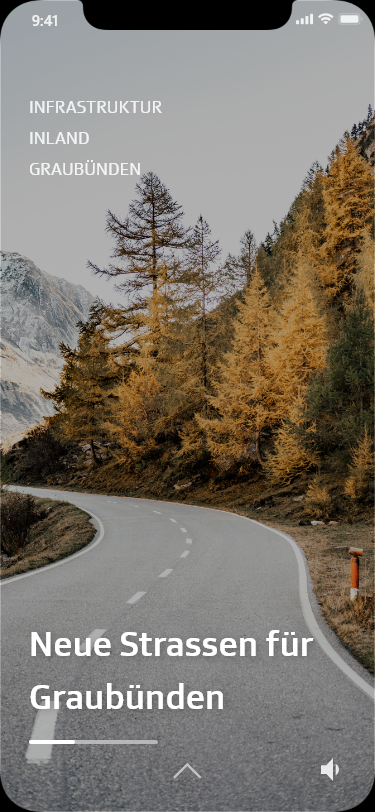 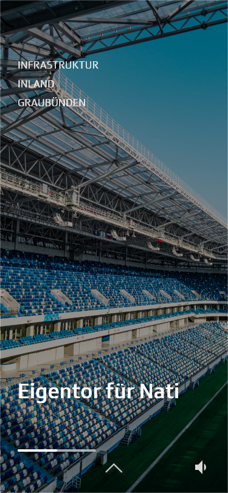  

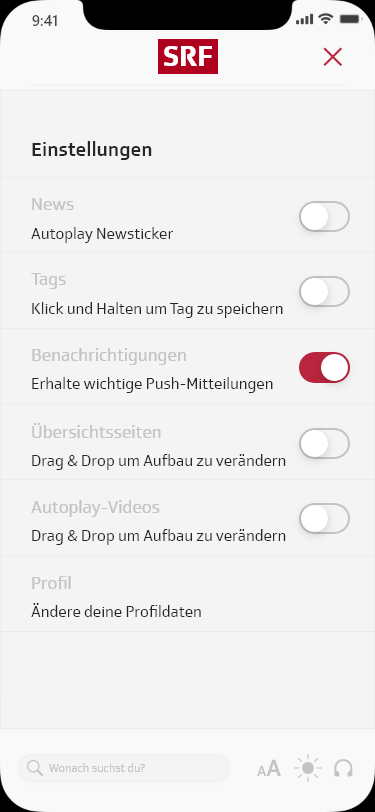  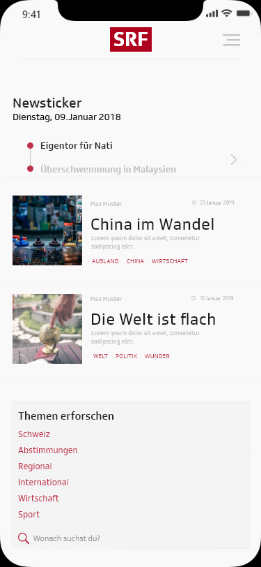 

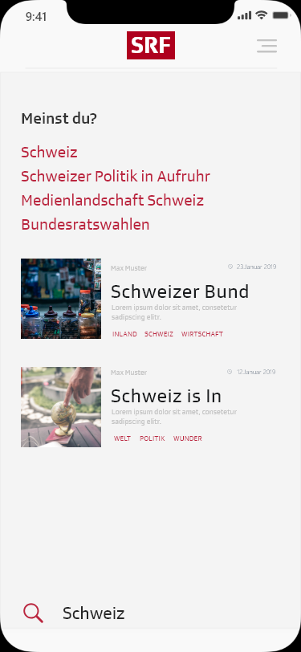 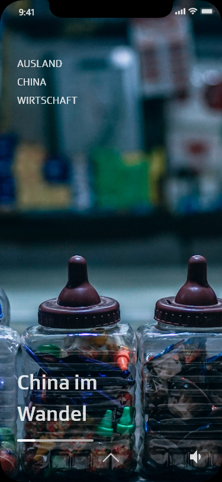 

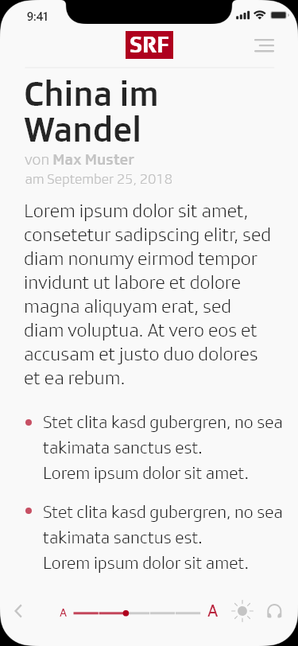 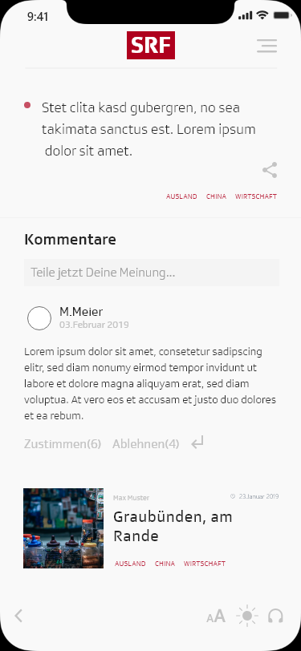 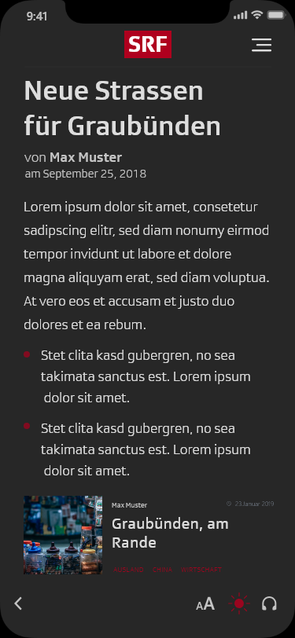 

